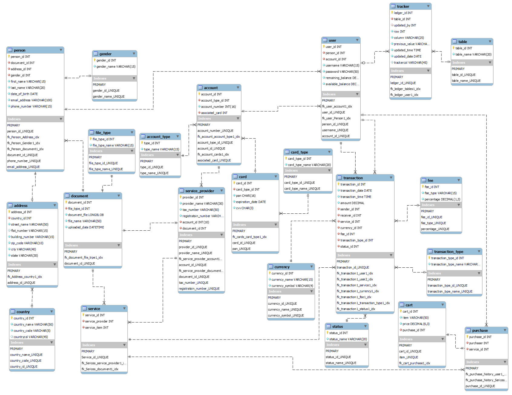

# Database Design for a Mobile Payment Service

 This repository contains a **MySQL**-based database design for a mobile payment service similar to platforms like Cash App or Venmo. Developed as part of my bachelor thesis, it is structured to support user account management, peer-to-peer transactions, service purchases, and robust auditing, with a strong emphasis on data integrity and scalability.

## Core Design Principles & Features

The entire schema was built upon a foundation of principles essential for any financial application, ensuring reliability and maintainability.

-   **ACID Compliance:** Built on a relational model to guarantee **A**tomicity, **C**onsistency, **I**solation, and **D**urability for every transaction, ensuring data is never left in a corrupted or inconsistent state.
-   **Normalization (up to 3NF):** The schema was systematically normalized to the **Third Normal Form (3NF)** to eliminate data redundancy, prevent update anomalies, and ensure data integrity.
-   **Scalability & Modular Design:** Core functionalities like user identity, accounts, and transactions are separated into logical, interconnected modules. This makes the system easier to maintain and allows for future expansion without requiring a major redesign.
-   **Audit and Tracking:** A dedicated `tracker` table functions as an immutable audit log, recording every change made to any row in the database. This provides a powerful layer of transparency crucial for financial auditing and forensic investigations.

## Database Schema (ERD)

The following Entity-Relationship Diagram provides a complete visual overview of the final, normalized schema, including all tables, columns, and the relationships between them.



### Key Entities

The schema is organized around these core entities:

1.  **Person:** Stores fundamental identity information (name, email, date of birth).
2.  **Address & Country:** Captures user and service provider addresses in a structured way.
3.  **User:** Represents a user's digital identity within the app, linking a `Person` to their account and balance.
4.  **Account & Card:** Manages linked financial instruments, including bank accounts and payment cards, with distinct types.
5.  **Transaction:** The central hub that records every money transfer, service purchase, and its associated metadata.
6.  **Service & Service Provider:** Tracks third-party services offered on the platform and the businesses that provide them.
7.  **Supporting Tables (`Fee`, `Currency`, `Status`, etc.):** A set of lookup tables that provide consistency and flexibility for managing transaction details.

## Repository Contents

This repository provides two key files to explore and use the schema:

1.  **`iPay database.mwb`**
    *   The MySQL Workbench file containing the full visual data model. This is the best way to interactively explore the schema, relationships, and constraints.

2.  **`iPay database.sql`**
    *   The complete SQL script required to generate the entire database schema. This file can be directly imported into any MySQL instance.

## Getting Started

To use this schema, you'll need a MySQL server and a client like MySQL Workbench or the command-line interface.

1.  **Clone the repository:**
    ```bash
    git clone https://github.com/NaolMengistu/iPay_database_design.git
    cd iPay_database_design
    ```

2.  **Choose your method:**
    *   **Option A (Visual Exploration):** Open the `iPay database.mwb` file in MySQL Workbench to view the interactive ERD.
    *   **Option B (Direct Deployment):** Import the `iPay database.sql` script into your MySQL instance to create all the tables.
        *   Example using the MySQL command line:
            ```bash
            mysql -u your_username -p your_database_name < "iPay database.sql"
            ```
